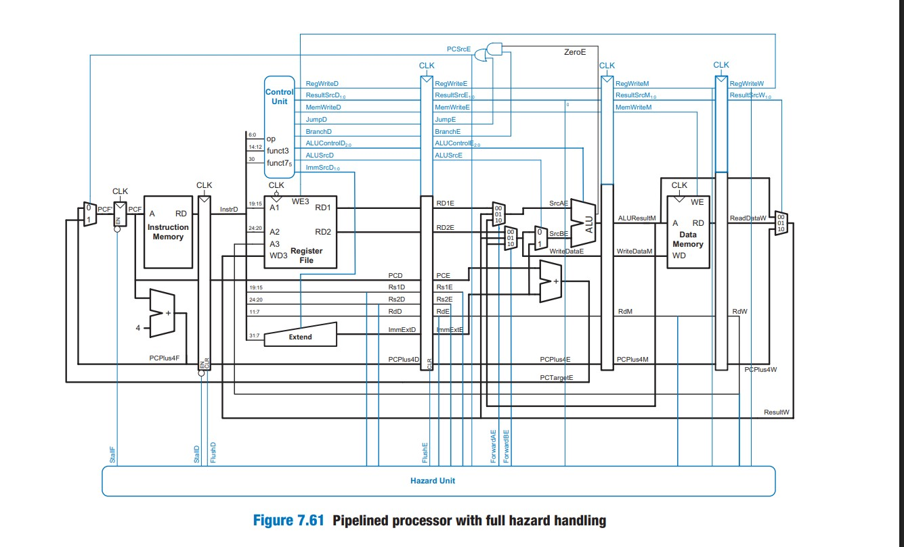

# Pipelined RISC-V Processor on FPGA

### Project Goal

After building an [8-bit breadboard computer](https://github.com/dawsonzhou225/breadboard-cube-solver) that solves a Rubik's cube in machine code, I wanted to take the next step: implement a real pipelined processor and run workloads on it that are actually relevant to modern computing. This is a 5-stage pipelined RISC-V (RV32I) processor written in SystemVerilog, synthesized and deployed on a Xilinx Basys-3 FPGA. It runs two programs: the same Pochmann blindfolded cube solver from the breadboard project, and a 4x4 matrix multiplication with thresholding at zero.

### Hardware

The processor is based on the pipelined RISC-V design from Harris & Harris' *Digital Design and Computer Architecture: RISC-V Edition*. The pipeline includes hazard detection with data forwarding, load-use stall logic, and branch flushing. A custom top-level module (basys3_top.sv) handles FPGA I/O: it captures store-word writes to addresses >= 64 into a 20-slot output buffer and drives the seven-segment display, with button navigation to scroll through results.

### Program 1: Matrix Multiplication with ReLU

Please click the photo below to view a short demo

Compute C = A * B, then apply ReLU(x) = max(0, x) element-wise, running entirely in software on RV32I with no hardware multiply.

Matrix A contains signed values, matrix B contains unsigned values. Since RV32I has no multiply instruction, multiplication is implemented via a shift-and-add loop. ReLU is three instructions: slt checks the sign, beq skips if positive, addi clamps to zero. The entire program fits in 89 instructions. Six of the sixteen output values are clamped to zero by ReLU and the display should show this as you scroll through the results.

### Program 2: Pochmann Rubik's Cube Solver

Please click the photo below to view a short demo

The same Old Pochmann blindfolded solving algorithm from the [breadboard project](https://github.com/dawsonzhou225/breadboard-cube-solver), ported to RISC-V assembly. Unlike the breadboard version, self-modifying code isn't needed here. The RISC-V processor has separate instruction and data memories, so the program can't overwrite itself even if it wanted to. Instead of pulling values directly from memory addresses, we load them into registers and use register-based addressing to traverse the permutation. Although much faster and more efficient than my breadboard computer, I believe it's important to note that it still an impeffect solution and shares the same practical limitations.

### Files

All the HDL files are written in SystemVerilog with the basys3_top.sv file as the FPGA top-level that wires up the CPU, output capture, and display driver. The two hex files (matmul_relu_program.hex and pochmann_program.hex) are what get loaded into instruction memory so drop either one in as program.hex to run it. You can also find my constraint file. Note that you will have to change the directory to wherever you put the program hex file for the top level file. The corresponding .txt files have the same hex with RISC-V assembly comments so you can follow the program without decoding by hand.

### Running It

Open the project in Vivado and add all the .sv files. Copy your chosen hex file to the path specified in basys3_top.sv as program.hex. Synthesize, implement, and generate the bitstream, then program the Basys-3. Results should appear on the seven-segment display and then simply press BTNR/BTNL to scroll through output values, BTNC to reset.

Final note: Everytime you put a different program you must re-synthesize, implement, and generate bitstream.

### Credits

- Harris & Harris, *Digital Design and Computer Architecture: RISC-V Edition* — processor design
- [Breadboard Cube Solver](https://github.com/dawsonzhou225/breadboard-cube-solver) — my original algorithm and inspiration